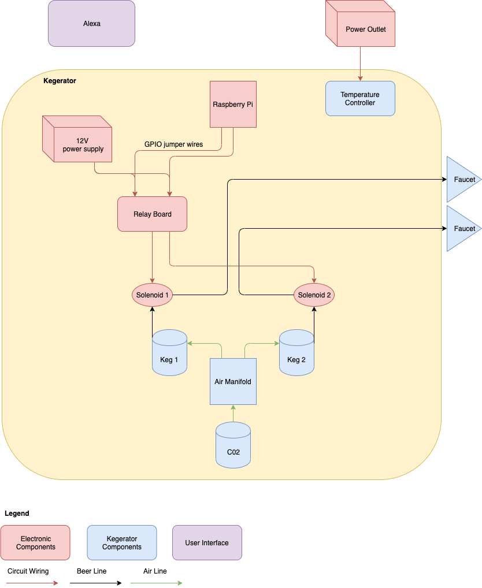

# Overview
Random little project hooking a kegerator up to Alexa &amp; controlling beer flow with a solenoid and a ML model. It's a bit over the top, but it was fun to make!

# Hardware
For this project I used the following
* [RaspberryPi 3B+](https://www.amazon.com/gp/product/B07BCC8PK7/ref=ppx_yo_dt_b_asin_title_o07_s00?ie=UTF8&psc=1)
* [5V Relay Board](https://www.amazon.com/gp/product/B00KTEN3TM/ref=ppx_od_dt_b_asin_title_s00?ie=UTF8&psc=1)
* [3V-12V power supply](https://www.amazon.com/gp/product/B01N7RS0NG/ref=ppx_yo_dt_b_asin_title_o06_s00?ie=UTF8&psc=1)
* [16 guage Wire](https://www.amazon.com/gp/product/B003J6AXC2/ref=ppx_yo_dt_b_asin_title_o06_s00?ie=UTF8&psc=1)
* [Jumper wires](https://www.amazon.com/gp/product/B073X7P6N2/ref=ppx_yo_dt_b_asin_title_o06_s00?ie=UTF8&psc=1)
* [Wire Nuts](https://www.amazon.com/gp/product/B078LSLKT7/ref=ppx_yo_dt_b_asin_title_o06_s00?ie=UTF8&psc=1)
* [USB Camera](https://www.amazon.com/gp/product/B006JH8T3S/ref=ppx_yo_dt_b_asin_title_o03_s00?ie=UTF8&psc=1)
* [1 1/4 inch Solenoid Valves](https://www.amazon.com/gp/product/B010LT30HE/ref=ppx_od_dt_b_asin_title_s00?ie=UTF8&psc=1)
* [2 3/16" hose barb to 1/4" male brass coupler](https://www.amazon.com/dp/B07P6X4493/ref=sspa_dk_detail_6?psc=1&pd_rd_i=B07P6X4493&pd_rd_w=171ht&pf_rd_p=45a72588-80f7-4414-9851-786f6c16d42b&pd_rd_wg=Mintz&pf_rd_r=CENJVND4GDC3QWVJ2DTQ&pd_rd_r=8eddca4b-e02c-44c4-838e-cbc5d0dc48fa&spLa=ZW5jcnlwdGVkUXVhbGlmaWVyPUEyTzAwUzc3SkgzNExWJmVuY3J5cHRlZElkPUEwMTc4NzczMklHMTZJTEVFTkNINiZlbmNyeXB0ZWRBZElkPUEwNzEwNjc1MUZMUFpLT1kxWVA4WCZ3aWRnZXROYW1lPXNwX2RldGFpbCZhY3Rpb249Y2xpY2tSZWRpcmVjdCZkb05vdExvZ0NsaWNrPXRydWU=)
* [3/16" food grade plasting tubing](https://www.amazon.com/gp/product/B00E6BCXQ8/ref=ppx_yo_dt_b_search_asin_title?ie=UTF8&psc=1)

## Kegerator
I purchased a kegerator, a co2 tank, and two Cornelious (corny) kegs from a seller off Craigslist. These corny kegs are refillable which allowed me to fill them up with water first so that I could test out the solenoid & "plumbing" without wasting a bunch of beer. These pony kegs use ball locks instead of a typical tap so beware that you'll have to use a different coupler if you want to use the kegs that are typically purchased from wine & beer shops.

# Hardware Diagram 
Below is a diagram showing how everything fits together. 

