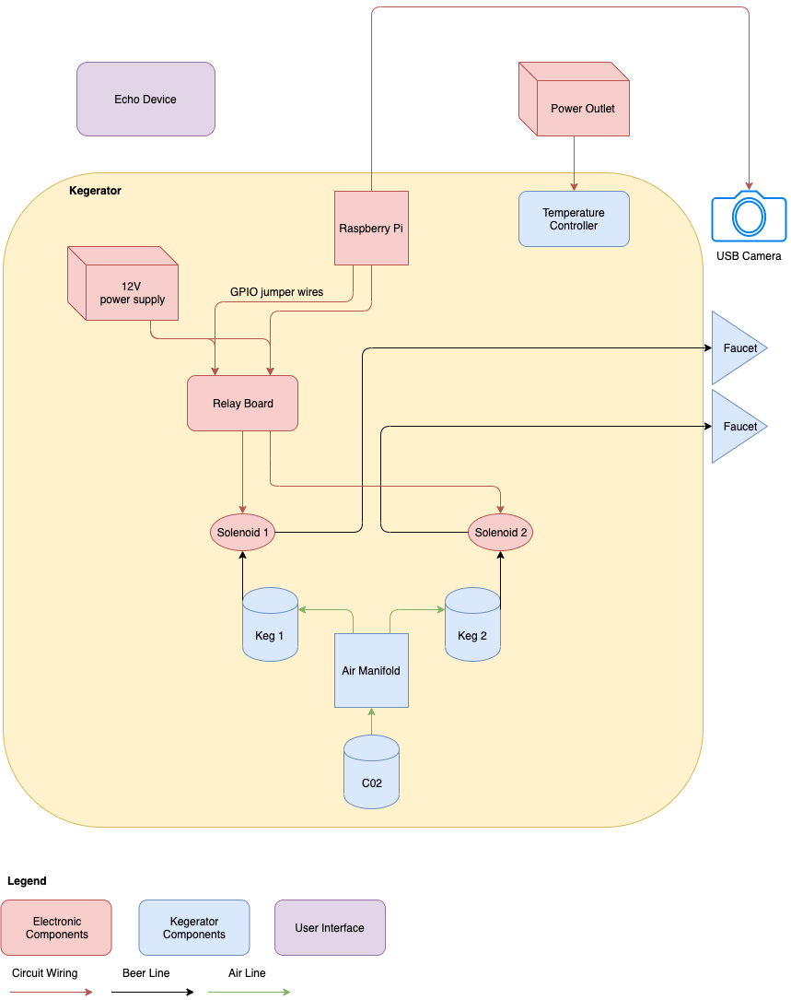

# Overview
Random little project hooking a kegerator up to Alexa &amp; controlling beer flow with a solenoid and a ML model. It's a bit over the top, but it was fun to make!

# Hardware
For this project I used the following
* [RaspberryPi 3B+](https://www.amazon.com/gp/product/B07BCC8PK7/ref=ppx_yo_dt_b_asin_title_o07_s00?ie=UTF8&psc=1)
* [5V Relay Board](https://www.amazon.com/gp/product/B00KTEN3TM/ref=ppx_od_dt_b_asin_title_s00?ie=UTF8&psc=1)
* [3V-12V power supply](https://www.amazon.com/gp/product/B01N7RS0NG/ref=ppx_yo_dt_b_asin_title_o06_s00?ie=UTF8&psc=1)
* [16 guage Wire](https://www.amazon.com/gp/product/B003J6AXC2/ref=ppx_yo_dt_b_asin_title_o06_s00?ie=UTF8&psc=1)
* [Jumper wires](https://www.amazon.com/gp/product/B073X7P6N2/ref=ppx_yo_dt_b_asin_title_o06_s00?ie=UTF8&psc=1)
* [Wire Nuts](https://www.amazon.com/gp/product/B078LSLKT7/ref=ppx_yo_dt_b_asin_title_o06_s00?ie=UTF8&psc=1)
* [USB Camera](https://www.amazon.com/gp/product/B006JH8T3S/ref=ppx_yo_dt_b_asin_title_o03_s00?ie=UTF8&psc=1)
* [1 1/4 inch Solenoid Valves](https://www.amazon.com/gp/product/B010LT30HE/ref=ppx_od_dt_b_asin_title_s00?ie=UTF8&psc=1)
* [2 3/16" hose barb to 1/4" male brass coupler](https://www.amazon.com/dp/B07P6X4493/ref=sspa_dk_detail_6?psc=1&pd_rd_i=B07P6X4493&pd_rd_w=171ht&pf_rd_p=45a72588-80f7-4414-9851-786f6c16d42b&pd_rd_wg=Mintz&pf_rd_r=CENJVND4GDC3QWVJ2DTQ&pd_rd_r=8eddca4b-e02c-44c4-838e-cbc5d0dc48fa&spLa=ZW5jcnlwdGVkUXVhbGlmaWVyPUEyTzAwUzc3SkgzNExWJmVuY3J5cHRlZElkPUEwMTc4NzczMklHMTZJTEVFTkNINiZlbmNyeXB0ZWRBZElkPUEwNzEwNjc1MUZMUFpLT1kxWVA4WCZ3aWRnZXROYW1lPXNwX2RldGFpbCZhY3Rpb249Y2xpY2tSZWRpcmVjdCZkb05vdExvZ0NsaWNrPXRydWU=)
* [3/16" food grade plasting tubing](https://www.amazon.com/gp/product/B00E6BCXQ8/ref=ppx_yo_dt_b_search_asin_title?ie=UTF8&psc=1)

## Kegerator
I purchased a kegerator, a co2 tank, and two Cornelious (corny) kegs from a seller off Craigslist. These corny kegs are refillable which allowed me to fill them up with water first so that I could test out the solenoid & "plumbing" without wasting a bunch of beer. These pony kegs use ball locks instead of a typical tap so beware that you'll have to use a different coupler if you want to use the kegs that are typically purchased from wine & beer shops.

# Hardware Details 
Below is a diagram showing how all the hardware fits together. 

## Hardware Components
**DISCLAIMER: I did a little bit of splicing power wires & electrical work to get this up and running. I'm just explaining what I did. I do not suggest anyone try this at home or condone doing anything similar. Playing with electricity is dangerous and you could die.**

* **Co2**: The Co2 tank pushes Co2 out through an air tube and into the keg. This creates enough pressure that when a beer line opens, beer is forced out of the keg and into the tubing which is connected to the tap
* **Air Manifold**: This is an optional piece if you have two kegs. It splits the air coming from the tube into two separate streams so that one Co2 tank can service multiple kegs. 
* **Keg**: What contains the beer. 
* **Faucet**: The location where the beer comes out. 
* **Solenoid**: A solenoid valve opens when it receives a 12Vs. The solenoid above defaults to closed. When we send a signal to it, it opens up allowing beer to flow through. This is how we control the flow of beer using our software stack 
* **Relay Board**: The relay board allows you to control a voltage supply with a much smaller voltage. In our case, we have 5V GPIO pins on our RaspberryPi, but our solenoid requires 12Vs to open. To get this to work, I had to cut the connector off the 12V supply & hook up the ground from the 12V supply to the ground of the solenoid. Then I hooked the + wire from the power supply to the relay. Finally I hooked up the + wire from the solenoid up to the same relay on the relay board. As you can imagine, these wires on their own aren't long enough to feed down into the kegerator to reach the solenoid & tubing. This is where the 16guage wire comes into play. You're not supposed to mix different guage wiring, but it's all I had and it worked. 
* **12V Power supply**: Generic power adapter. I needed more than 5Vs so I drew it from a power outlet using this device. 
* **RaspberryPi**: Lightweight & cheap computer that I could use to run AWS Greengrass off of which also allowed me to control circuits. It has things called GPIO (general purpose input/output) pins which you can hook jumper wires to & send electrical signals through code. I used the jumper wires above to send signals from the Pi's GPIO to the relay so that I could open and close the 12V circuit / open the solenoid valve. 
* **USB Camera**: This is a generic USB camera that I used to get images of the beer being poured. These images were then ran through an ML model which returned whether the glass was full or not. If the glass was full, it would turn off the solenoid.
* **Echo Device**: An Amazon echo dot that I used for the voice interface. 

# Software Components
Below is a diagram showing how all the software fits together

## Software Components
* **Echo**: This is a device which converts speech to a request that's sent to ASK (alexa skill kit). Largely a black box for this prototype. You whitelist your skill on it & it shuttles your request to the Alexa backend system. 
* **Alexa Skill Kit**: Collection of self service APIs & tools that allow you to build Alexa skills. I defined the skill in the skill kit & set my backend lambda as the target for the request the skills kit generated. Not a lot of logic lived on the skill itself. 
* **Lambda**: AWS lambda lets you run event driven code without dealing with any infrastructure (i.e. serverless). The Alexa skill kit sends the request initiated by an echo user to this Lambda which then processes it & either gives back information, or sends a message to our Kegerator asking it to open the solenoid for beer to flow out. 
* **IoT Core**: AWS service which is effectively a message broker for messages between IoT devices and the AWS cloud. You get a unique endpoint and push messages to topics. Devices listening on those topics receive the message. I used it to facilitate sending messages between our Alexa Lambda function & the Pi running something called AWS Greengrass. 
* **Greengrass**: Greengrass is an AWS service that lets you run Lambda functions on your own edge device. You download the Greengrass core software onto your device and it creates a runtime environment that will execute your lambda functions on the edge device. It also provides an easy way to authenticate requests to and from the cloud via IoT Core using x.509 certs. 
* **SageMaker**: AWS service for training & deploying ML models. I don't have access to a giant GPU & didn't want to go through the hassle of setting up my own EC2 instance, so I just started up a Jupyter Notebook in SageMaker and kicked off a training job through it. Note: You can accomplish the same thing using an EC2 instance it's just more work. Once I trained the model, I hosted it on a SageMaker endpoint & called the endpoint with binary encoded images to get back whether the cup was full or not. Yes, this is very unnecessary & the same thing can be accomplished with a weight sensor, but I wanted to learn how this all worked and had a lot of fun in the process. 

